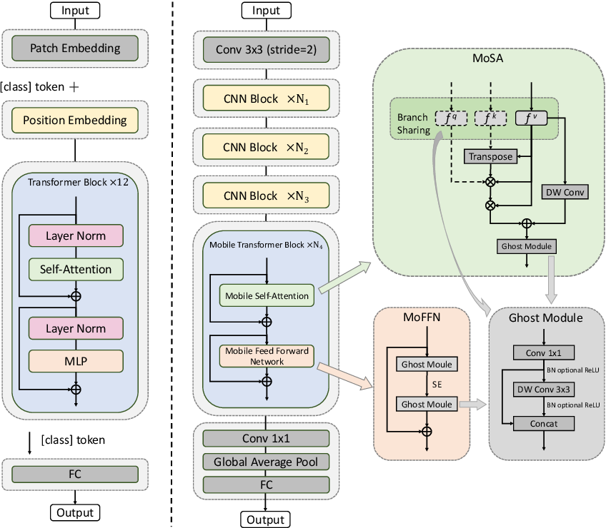

# MoCoViT: Mobile Convolutional Vision Transformer
### Work in Progress!

<table>
<tr><td colspan="2"></td></tr>
<tr><td><b>ViT</b></td><td><b>MoCoViT</b></td></tr>
</table>

## Introduction
This repository is a PyTorch implementation of "MoCoVit: Mobile Convolutional Vision Transformer" by [Ma et al](https://arxiv.org/abs/2205.12635v1), a convolutional/transformer hybrid model designed for mobile applications.

MoCoViT is heavily based off "GhostNet: More Features from Cheap Operations" by [Han et al.](https://arxiv.org/abs/1911.11907) and this implementation utilizes code from the [ghostnet.pytorch](https://github.com/iamhankai/ghostnet.pytorch) repository. Unlike the original [Vision Transformer](https://arxiv.org/abs/2010.11929) (on the left in the figure above), MoCoViT (right) utilizes convolutional layers (using the feature extractor from GhostNet) to generate the patches passed to the transformer blocks. From there, the Mobile Transformer Block utlizes simplifed versions of self-attention and feed forward networks described in the paper and illustrated above. 

In its current state, the output of MoCoViT is predictions on 1000 classes for use with ImageNet.

## Installation
This repo uses [ghostnet.pytorch](https://github.com/iamhankai/ghostnet.pytorch) as a git submodule, so cloning must be done recursively:
```
git clone --recursive https://github.com/smitheric95/MoCoViT-PyTorch.git
```

## Coming Soon
- Better training scripts.
- Inference/testing scripts.
- Pre-trained model checkpoints.


## Citation
```
@misc{
  url = {https://arxiv.org/abs/2205.12635v1},
  author = {Ma, Hailong and Xia, Xin and Wang, Xing and Xiao, Xuefeng and Li, Jiashi and Zheng, Min},
  title = {MoCoViT: Mobile Convolutional Vision Transformer},
  year = {2022}
}
```